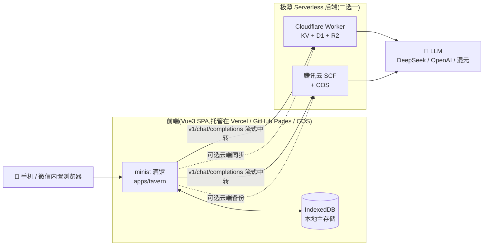

<div align="center">

# 🍻 minist · MiniTavern

**免备案 Serverless 酒馆 —— 把 SillyTavern 裁剪移植进 Cloudflare / 腾讯云 SCF,完美适配手机与微信内置浏览器**

[](./LICENSE)
[](https://nodejs.org)
[](./CONTRIBUTING.md)
[](https://vuejs.org)
[](https://workers.cloudflare.com)
[](https://cloud.tencent.com/product/scf)

</div>

> **一句话**:干掉 Node.js 后端,把酒馆变成**纯前端 SPA + 极薄 Serverless 中转**,聊天记录躺在你手机本地(IndexedDB),云端只做备份与大模型代理;手机/微信里点开即聊,**默认零成本**。

---

## 📖 这是什么

原版 [SillyTavern](https://github.com/SillyTavern/SillyTavern) 依赖 Node.js 后端 + 本地文件系统,无法跑在 Cloudflare Workers / 腾讯云 SCF 这类"无持久化文件系统、按运行时间计费"的平台上;其默认域名(`*.pages.dev` / `*.workers.dev` / SCF 三级域名)在**微信内置浏览器内被重度拦截**,手机访问体验极差。

`minist` 对原版做"外科手术式"裁剪移植:

| 维度 | 决策 |
|---|---|
| 架构 | **纯前端 SPA + 极薄 Serverless 后端**(剔除 Node 后端 / Extras / WebSocket) |
| 存储 | **IndexedDB 本地优先**,云端(KV/D1/R2 或 COS)仅做备份/同步 |
| 后端 | **双平台**:Cloudflare Worker(TS) / 腾讯云 SCF Web 函数(Node),同一套路由契约 |
| 保留 | 聊天、人物卡 **V2/V3** 解析、世界书、流式打字机(SSE)、基础预设 |
| 降级 | 组队聊天改手动触发、记忆总结改前端触发 |
| 适配 | 触控上传、独立发送按钮、流式断线重连、IndexedDB 可清空/导出、PWA 离线壳 |

📖 完整裁剪对照表见 [`docs/architecture.md`](./docs/architecture.md)

---

## ✨ 特性

- 🃏 **纯前端人物卡解析** —— 浏览器内直接读取 PNG `tEXt`(`chara` V2 / `ccv3` V3)隐写元数据,不经后端,移植自 SillyTavern 的解析逻辑。
- ⌨️ **流式打字机** —— OpenAI 兼容 SSE,逐 token 渲染,可随时中断。
- 💾 **本地优先** —— 角色/聊天/世界书/预设全部存 IndexedDB,断网刷新照样在;微信切后台挂起后提供"重取最后回复"。
- ☁️ **双后端中转** —— Cloudflare Worker / 腾讯云 SCF 二选一,只负责大模型代理 + 可选云端同步。
- 📱 **微信/手机专项** —— 触控文件选择、防误触缩放、hash 文件名破微信顽固缓存、安全区适配、独立发送按钮。
- 🔐 **免备案防审查** —— 前端可托管 Vercel/GitHub Pages 避开 CF 默认域名被墙;`X-Crypto-Data` Base64 混淆让聊天明文变"乱码"。
- 🚀 **一键部署平台** —— 配套案例网站(`apps/platform`),引导你把酒馆部署到**自己的** CF / 腾讯云账号,管理配置、同步角色卡与世界书,并用 AI 助手排障。

---

## 🏗️ 架构



📖 数据流与契约一致性详见 [`docs/architecture.md`](./docs/architecture.md)

---

## 📦 仓库结构

```
minist/
├─ apps/
│  ├─ tavern/              🍺 酒馆前端 SPA(Vue3 + Vite + TS + Pinia)
│  └─ platform/            🚀 案例部署平台(一键部署 + 配置 + 同步 + AI 助手)
├─ packages/
│  ├─ core/                🧠 纯逻辑:人物卡解析 / 世界书 / Prompt 构建(浏览器可用)
│  ├─ shared/              📐 全栈契约:路由 / 加密 / 类型(单一事实来源)
│  ├─ worker-cloudflare/   ☁️ CF Worker 后端(TS + KV/D1/R2 + CAM 中转)
│  ├─ scf-tencent/         ☁️ 腾讯云 SCF Web 函数(Node + COS + 自管理)
│  └─ deploy-agent/        🤖 部署助手:prompt + 避坑知识库
├─ docs/                   📚 架构 / 双平台部署 / 计费测算
└─ examples/               🧩 示例人物卡 + 世界书
```

---

## 🚀 快速开始(本地开发)

```bash
git clone https://github.com/minist-tavern/minist.git
cd minist
npm install            # 链接所有 workspace 包

npm run dev:tavern     # 启动酒馆前端  → http://localhost:5173
npm run dev:platform   # 启动部署平台   → http://localhost:5174
npm run dev:worker     # 本地 CF Worker  (npx wrangler dev)
npm run dev:scf        # 本地 SCF express(端口 9000)
```

**第一次聊天**:打开酒馆 → 侧边栏「设置」→ 后端选 `本地/直连` → 填 LLM 服务地址(如 `https://api.deepseek.com`)与 API Key → 回到聊天发送消息即可看到流式打字机。

**导入示例角色**:侧边栏「角色」→ 导入 → 选 `examples/characters/sample-xiaoman.json`。

---

## ☁️ 部署到自己的云账号

> 想让手机/微信随时访问?选一条路径:

### 路径 A:Cloudflare(全免费,推荐自用)
前端 → Vercel/GitHub Pages;API → CF Worker;数据 → KV(角色卡)+ D1(聊天)+ R2(图片,无出流量费)。
📖 完整步骤、资源清单、避坑: [`docs/deploy-cloudflare.md`](./docs/deploy-cloudflare.md)

### 路径 B:腾讯云 SCF(微信生态友好)
静态 → COS 托管;API → SCF Web 函数;数据 → 你**自己的** COS 桶。免备案走 **CloudBase Web 触发器** 或 **Tailscale 内网**通道。
📖 完整步骤、CAM 授权流程、计费测算、避坑: [`docs/deploy-tencent.md`](./docs/deploy-tencent.md)

### 一键部署平台
启动 `apps/platform`,在网页上选平台 → 跟着向导走 → 自动建资源 / 自动配置(SCF 自锁 60s 超时防爆产)→ 把生成的 URL 填回酒馆。内置 **AI 部署助手**,遇到报错贴进去即给排障步骤。

💰 两平台真实月成本测算见 [`docs/cost.md`](./docs/cost.md)(个人低频使用:CF ≈ 0 元,腾讯云 ≈ 0.5~2 元)。

---

## 🔐 免备案与防审查要点

- **微信拦截默认域名**:CF 的 `*.pages.dev`/`*.workers.dev`、腾讯云 SCF 三级域名在微信内高概率打不开 → 前端托管到 **Vercel / GitHub Pages**,腾讯云则走 **CloudBase 白名单域名** 或 **Tailscale 内网**。
- **明文审查**:`X-Crypto-Data` 协议把手机↔后端之间的聊天 payload 做 Base64 混淆(混淆非加密,API Key 仍走 HTTPS `Authorization`),降低被运营商 DNS 污染概率。
- **不暴露密钥**:一键配置用 **CAM 跨账号授权**(腾讯)或 **Token 自改**(SCF 自己改自己),绝不让人输入主账号 SecretKey。

---

## 🗺️ 路线图与已知边界

**v0.1.0(MVP,本次交付)** —— 全模块纵向贯通,端到端架构可用:
- ✅ 聊天 / 流式 / 人物卡 V2V3 / 世界书 / 预设 / 双后端 / 部署平台 / AI 助手 / 文档
- ⚠️ **CAM 跨账号授权(方案一)** 代码完整,需真实腾讯云凭证端到端验证;`自用 Token 自改(方案二)` 可即时测试。
- ⚠️ CF `/api/cf-setup`、CAM STS 中转需对应平台真实 API Token 验证。
- ⚠️ 前端为精简实现(非 SillyTavern 功能满血);token 计数为启发式估算。

**后续**:精确 tokenizer、人物卡编辑器、完整组队聊天、向量检索的 AI 助手、EdgeOne 方案。

---

## 🤝 贡献

欢迎 PR!请先读 [CONTRIBUTING.md](./CONTRIBUTING.md)。采用约定式提交(`feat(tavern): ...`),分支 `main`/`dev`。

> 本仓库仅作为**通用工具**,Issue/PR 中的示例请使用 SFW 内容。

## 📄 协议

[AGPL-3.0](./LICENSE)。本项目是 [SillyTavern](https://github.com/SillyTavern/SillyTavern)(AGPL-3.0)的衍生裁剪移植,人物卡解析逻辑改编自其 `src/character-card-parser.js`。衷心感谢 SillyTavern 团队。

## ⚠️ 免责声明

minist 是中立的本地 AI 聊天工具,不内置、不分发任何具体对话内容,不对用户使用 LLM 生成的内容负责。请遵守你所在地区的法律法规与你所用 LLM 服务条款。在中国大陆通过备案域名对外提供服务需自行完成合规备案与内容审核。

<div align="center">

**⭐ 如果 minist 帮到了你,欢迎 Star**

</div>
