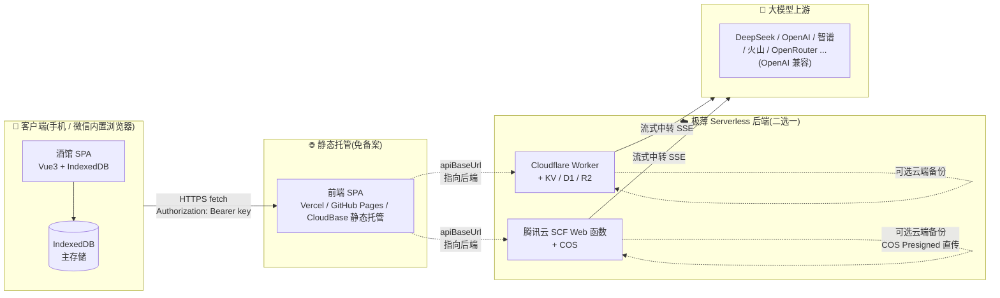
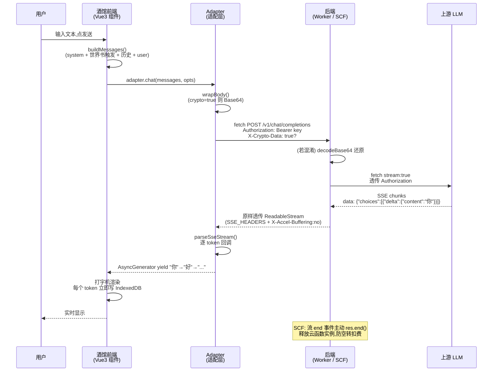

# minist 架构与裁剪移植说明

> minist(MiniTavern)是 [SillyTavern](https://docs.sillytavern.app/) 的裁剪移植版,目标是让一个**纯前端 SPA + 极薄 Serverless 后端**的酒馆能在手机/微信内置浏览器里跑起来,免备案、低门槛自部署。
>
> 本文回答四个问题:**整体长什么样**(架构图) **与原版比砍了什么**(裁剪对照) **数据存哪**(本地优先存储) **消息怎么流转**(数据流),并解释双后端的契约一致性是如何被工程化保证的。

---

## 目录

- [一、整体架构](#一整体架构)
- [二、原版 vs 移植版:裁剪对照表](#二原版-vs-移植版裁剪对照表)
- [三、本地优先存储设计](#三本地优先存储设计)
- [四、消息数据流:从发送到打字机渲染](#四消息数据流从发送到打字机渲染)
- [五、双后端契约一致性](#五双后端契约一致性)
- [六、关键文件索引](#六关键文件索引)

---

## 一、整体架构



**三句话总结**:

1. **前端 SPA 是主存储**,聊天/人物卡/世界书/预设全部沉在浏览器 IndexedDB,换设备靠"可选的云端备份"恢复。
2. **后端只做两件事**:① 把 OpenAI 兼容的请求**流式中转**给上游 LLM(规避手机直连被墙/跨域);② 提供 KV/D1/R2 或 COS 作**可选**备份/同步存储。
3. **后端是二选一的非耦合实现**:Cloudflare Worker(TypeScript)与腾讯云 SCF(CommonJS / express)独立部署,通过同一份路由契约(`@minist/shared`)保证行为一致。

---

## 二、原版 vs 移植版:裁剪对照表

SillyTavern 原版是 Node 全栈 + 丰富插件生态,体量大、依赖服务器。minist 裁剪为"手机可用、可免备案自部署"的最小子集。

### ✅ 完整保留(核心角色扮演体验)

| 能力 | 移植版实现 | 说明 |
|------|-----------|------|
| **聊天主流程** | `apps/tavern` 聊天页 + 流式渲染 | OpenAI 兼容消息格式,逐 token 打字机 |
| **人物卡 V2 / V3** | `packages/core` 的 `character-card` 模块 | PNG tEXt/iTXt 块 `chara`/`ccv3` 字段解析,V3 优先 |
| **世界书(Lorebook)** | `packages/core` 的 `worldinfo` 模块 | 关键词触发注入,与原版世界书 JSON 兼容 |
| **流式输出(SSE)** | `fetchStream` + `parseSseStream` | fetch + ReadableStream(不用 EventSource,因后者不支持 POST + 自定义头) |
| **预设(Preset)** | `packages/core` 的 `prompt` 模块 | system / 示例对话 / 温度 / maxTokens 等参数化 |
| **多角色名(name 字段)** | `ChatMessage.name` | 多角色组队时区分发言人 |

### 🔻 降级实现(功能在,但形态简化)

| 能力 | 原版 | 移植版降级 | 原因 |
|------|------|-----------|------|
| **组队聊天(Group Chat)** | 自动多角色轮转,有调度策略 | 改为**手动触发**:用户选当前发言角色再发送 | 多角色自动调度逻辑重,手机交互下手动更可控 |
| **记忆总结(Summarize)** | 后台定时触发总结 | 改为**前端手动触发**:用户点"总结当前对话"按钮 | 避免后端常驻/定时任务,贴合 Serverless 模型 |
| **云端同步** | 全量 + 增量 | **全量 JSON 包**(整包上传/拉取) | 个人/熟人低频使用,增量合并复杂度不值得 |

### ✂️ 彻底裁剪(不做)

| 能力 | 裁掉的理由 |
|------|-----------|
| **Node 后端(express 常驻)** | 与"纯静态托管 + Serverless"目标冲突;后端逻辑全收敛到 Worker/SCF 极薄层 |
| **Extras 插件系统**(TTS / STT / 翻译 / 情感分析 ...) | 插件依赖 Python 后端与常驻进程,手机场景用不到;语音改用浏览器原生 Web Speech API(可选) |
| **本地 TTS / STT** | 浏览器原生 `speechSynthesis` / `SpeechRecognition` 已够用,无需服务端 |
| **WebSocket 长连接** | 改用 **HTTP SSE 流式**(单向推送足够),避开 WebSocket 在国内移动网络与微信内的稳定性问题 |
| **完整扩展市场 / 主题市场** | 维护成本高,主题内置一套移动优先样式 |

> 裁剪原则见 `CONTRIBUTING.md` 的"裁剪移植原则":无 Node 后端 / 本地优先 / 手机微信友好 / 免备案。

---

## 三、本地优先存储设计

### 为什么 IndexedDB 是主存储

minist 走的是 **local-first** 架构:

| 维度 | IndexedDB(主) | 云端(KV/D1/COS,备份) |
|------|---------------|----------------------|
| **可用性** | 离线可用,无网络也能看历史 | 必须联网 |
| **延迟** | <10ms | 数十~数百 ms(跨域 + Serverless 冷启动) |
| **配额** | 浏览器约磁盘 60%(Chrome) | KV 写 1000/天 / D1 写 10 万/天 / COS 按量 |
| **隐私** | 数据不出设备 | 经 Serverless 中转 |
| **换设备** | ❌ 需手动导出/导入或云同步 | ✅ 同步后新设备拉取 |

**结论**:日常使用 100% 走 IndexedDB;云端只在用户**主动点"同步"**或**换设备**时落地。这样即使 Serverless 免费额度被打爆,本地体验完全不受影响。

### IndexedDB 配额兜底

见知识库 `common-indexeddb-quota`(`packages/deploy-agent/src/knowledge.ts`):

- 用 `navigator.storage.estimate()` 定期检查 `usage / quota`,接近 80% 提示清理旧聊天。
- 分库策略:角色卡/世界书(只读为主)单独 store;聊天按角色分 store,可单独删除。
- 大文件(人物卡 PNG)优先存云端 R2/COS,本地只存 URL + 元数据。
- PWA:Service Worker + manifest,可装到手机主屏离线使用。

### X-Crypto-Data 混淆协议:何时启用

定义在 `packages/shared/src/crypto.ts` + `routes.ts`:

```
HEADERS.cryptoData = 'X-Crypto-Data'   // 值为 "true" 时启用
```

**何时启用**:仅当 `TavernConfig.crypto = true` 时启用。典型场景:

1. **国内免备案移动网络**:明文 JSON 经边缘节点转发时可能被中间设备基于关键词阻断,Base64 化后降为"乱码",降低被自动化审查拦截概率。
2. **微信内置浏览器**:微信对明文敏感词有审查,混淆后更稳。

**协议原理**(见 `apps/tavern/src/adapters/cloudflare.ts` 的 `wrapBody`):

- **请求侧**:前端把 JSON `encodeBase64()` 后作为 body,`Content-Type` 改为 `text/plain;charset=UTF-8`(伪装非 JSON),并带 `X-Crypto-Data: true` 头。
- **后端侧**:Worker / SCF 见到该头先 `decodeBase64()` 还原再处理。`/api/storage` 路由特殊:**原样存密文**,Worker 零明文、零密钥。
- **流式响应侧**:**不二次混淆**(避免破坏 SSE chunk 边界导致断连)。

> ⚠️ **重要边界**:这是**混淆不是加密**,防的是自动化审查,不防主动攻击者。真正的 API Key 始终走 HTTPS `Authorization` 头,绝不进 body、不进 Worker 日志。需要端到端加密请用 `xorEncode` 叠加一层(共享密钥需自行安全分发)。

---

## 四、消息数据流:从发送到打字机渲染

一次"用户发消息 → 看到 AI 回复"的完整链路:



**关键环节详解**:

1. **`buildMessages()`**(`packages/core` 的 `prompt` 模块):按角色卡 system prompt + 世界书关键词匹配条目 + 历史消息(截断) + 当前 user 输入,组装成 OpenAI 兼容 `messages[]`。
2. **`adapter.chat()`**(适配层):三种实现共享同一接口 `BackendAdapter`(`apps/tavern/src/adapters/types.ts`):
   - `LocalAdapter` / `direct`:直连 LLM,不经过后端。
   - `CloudflareAdapter`:`POST {base}/v1/chat/completions`,Authorization 透传。
   - `TencentAdapter`:继承 CloudflareAdapter,额外支持人物卡 PNG 走 COS Presigned 直传。
3. **`wrapBody()`**:按 `config.crypto` 决定是否 Base64 混淆。
4. **`fetchStream()`**(`adapters/stream.ts`):用 `fetch` + `ReadableStream` 发起请求,把 push-based 的 `parseSseStream` 回调桥接到 pull-based 的 `AsyncGenerator`,支持 `controller.abort()` 中断("停止"按钮)。
5. **`parseSseStream()`**(`@minist/shared`):按 SSE 规范解析 `data: ...` 行,处理 `[DONE]` 与多行 `data:` 拼接。
6. **打字机渲染**:前端组件 `for await (const token of handle.stream)` 逐 token 更新 DOM,同时写 IndexedDB(断连也不丢已输出内容,见知识库 `common-sse-reconnect`)。
7. **防扣费**(SCF 专属):`upstreamRes.data.on('end', () => res.end())` —— 流结束主动释放云函数实例,杜绝"数据传完但实例仍存活被计时"的空转扣费。

---

## 五、双后端契约一致性

minist 的后端是**两套独立实现**(Cloudflare Worker TS + 腾讯云 SCF JS),如何保证它们对外行为一致?靠**单一事实来源 + 复制同步**的双轨机制。

### 单一事实来源(Single Source of Truth)

`packages/shared/src/routes.ts` 是契约的**唯一权威定义**:

```typescript
export const ROUTES = {
  health: '/api/health',
  storage: '/api/storage',     // /api/storage/:key
  chat: '/api/chat',            // /api/chat/:userId
  r2: '/api/r2',                // /api/r2/:key (CF) / /api/r2/presign (SCF)
  sync: '/api/sync',            // /api/sync[/:userId]
  adminTimeout: '/api/admin/set-timeout',  // SCF 方案二
  grantConfig: '/api/grant-config',        // CF 方案一(CAM 中转)
  cfSetup: '/api/cf-setup',                // CF 方案一(自动建资源)
  completions: '/v1/chat/completions',
} as const;
```

配套的 `HEADERS`、`CORS_HEADERS`、`SSE_HEADERS`、`SYNC_VERSION` 也在同一文件,被以下消费者直接 import:

- `packages/worker-cloudflare` —— TypeScript,`import { ROUTES } from '@minist/shared'`
- `apps/tavern`(前端适配层)—— TypeScript,同样 import
- `apps/platform`(部署平台)—— TypeScript,同样 import

### 复制同步(Copy for Independence)

腾讯云 SCF 包**独立打包成 zip 上传到用户自己的腾讯云账号**,运行在云函数里。它**不能依赖 monorepo 的 `@minist/shared`**(CommonJS/ESM 边界 + 自包含约束)。因此在 `packages/scf-tencent/src/constants.js` 维护一份**等价常量副本**:

```javascript
// 文件头明确标注:⚠️ 本文件须与 @minist/shared 保持同步
const ROUTES = Object.freeze({ /* 与 routes.ts ROUTES 逐项一致 */ });
const HEADERS = Object.freeze({ /* ... */ });
const SYNC_VERSION = 1;  // 与 shared 同步
```

**同步纪律**(已写入两处文件头):

- 任何路由 / 头 / 版本号变更,必须**同时修改** `shared/src/routes.ts` 与 `scf-tencent/src/constants.js`。
- 两者的 `SYNC_VERSION` 必须相等,前端用版本号校验兼容性。
- 类型契约在 `shared/src/types.ts`,SCF 侧用 JSDoc 注释人工对齐。

### 路由差异(有意为之,非 bug)

两后端并非完全镜像,差异源于平台能力:

| 路由 | Cloudflare Worker | 腾讯云 SCF | 差异原因 |
|------|-------------------|-----------|----------|
| `/api/storage/:key` | ✅ KV 读写(角色卡索引) | ❌ 不实现 | SCF 无 KV 等价物,角色卡走 COS |
| `/api/chat/:userId` | ✅ D1 聊天历史 | ❌ 不实现 | SCF 主存储是 IndexedDB,聊天不落 SCF |
| `/api/r2/presign` | ❌(R2 直接 Worker 代理) | ✅ COS 预签名直传 | SCF 走 Presigned 让前端直传,省函数流量 |
| `/api/admin/set-timeout` | ❌(Worker 无等价自改) | ✅ 方案二核心 | SCF 运行时临时凭证可"自己改自己" |
| `/api/cf-setup` | ✅ 方案一(自动建 KV/D1/R2) | ❌ | CF 专属自动配置 |
| `/api/grant-config` | ✅ 方案一(CAM 中转入口) | ❌(主体在 Worker) | Worker 作平台中转层,见 `deploy-tencent.md` |
| `/v1/chat/completions` | ✅ 流式中转 | ✅ 流式中转 | **核心,两者必须行为一致** |
| `/api/sync` | ✅ KV + D1 拆分 | ✅ COS 整包 | 存储后端不同 |

前端适配层(`CloudflareAdapter` / `TencentAdapter`)封装了这些差异,上层组件只面向 `BackendAdapter` 接口编程,不感知具体后端。

---

## 六、关键文件索引

| 主题 | 文件 |
|------|------|
| 全栈契约(路由/头/类型) | `packages/shared/src/routes.ts`、`types.ts`、`crypto.ts` |
| SSE 解析 | `packages/shared/src/api.ts`(`parseSseStream`) |
| CF Worker 入口与路由 | `packages/worker-cloudflare/src/index.ts`、`src/routes/*.ts` |
| CF Worker 环境绑定 | `packages/worker-cloudflare/src/env.ts`、`wrangler.toml` |
| SCF 入口与路由 | `packages/scf-tencent/src/index.js`、`src/routes/*.js` |
| SCF 复制契约 | `packages/scf-tencent/src/constants.js` |
| 前端适配层 | `apps/tavern/src/adapters/{index,types,cloudflare,tencent,local,stream}.ts` |
| 核心能力(人物卡/世界书/Prompt) | `packages/core/src/{character-card,worldinfo,prompt}/*` |
| 避坑知识库 | `packages/deploy-agent/src/knowledge.ts` |
| 部署步骤 | `docs/deploy-cloudflare.md`、`docs/deploy-tencent.md` |
| 计费测算 | `docs/cost.md` |

---

下一篇:[Cloudflare 部署指南](./deploy-cloudflare.md) · [腾讯云部署指南](./deploy-tencent.md) · [计费测算与选型](./cost.md)

License: AGPL-3.0-only · minist contributors
