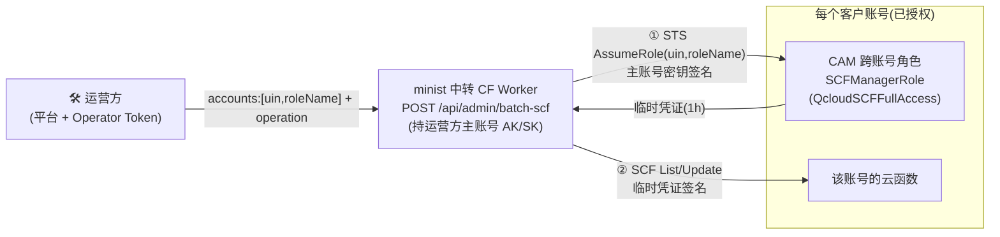

# 批量管理外部腾讯云账号的云函数(运营方控制面)

> 适用对象:**平台运营方**(在自己中转 Worker 上配了 `OPERATOR_TOKEN` 的人)。
> 场景:你需要集中管理多个**客户**(其他腾讯云主账号)的云函数 —— 列出、批量自锁防爆产配置等。
> 核心原则:**绝不索要客户的 SecretId/SecretKey**。用腾讯云 CAM 跨账号角色 + STS `AssumeRole` 临时凭证。

## 架构



运营方主账号长期密钥只在**自己的中转 Worker**(Secrets)里;客户只给 `uin + 角色名`,不给任何密钥。临时凭证 1 小时过期,客户可随时在 CAM 撤销角色或缩为只读。

## 客户侧(一次性授权,客户自己在腾讯云操作)

> 把下面这段发给每个客户。客户做完,把 **主账号 ID(uin)** 和 **角色名** 给你。

1. 登录 [腾讯云访问管理 CAM](https://console.cloud.tencent.com/cam/role) → **角色** → **新建角色**。
2. 选 **「腾讯云账户」** 方式 → 载体选 **「其他主账号」** → 填入**运营方的腾讯云主账号 ID**。
3. 策略:搜索并勾选 `QcloudSCFFullAccess`(云函数全控制);若只希望被"列出自锁"不被改代码,可用更小的自定义策略(含 `scf:ListFunctions`、`scf:UpdateFunctionConfiguration`)。
4. 角色名:如 `SCFManagerRole`(自定义,记住它)。
5. 把 **自己的主账号 ID** 和 **角色名 `SCFManagerRole`** 发给运营方。

## 运营方侧(平台操作)

1. 在自己部署的中转 Worker 上配 Secrets:
   - `TENCENT_SECRET_ID` / `TENCENT_SECRET_KEY`(运营方主账号长期密钥)
   - `OPERATOR_TOKEN`(自定义强随机串,作为批量管理接口的鉴权门)
   - `TENCENT_REGION`(默认地域,可选)
2. 打开案例部署平台的「**批量管理**」页(/platform/ 的导航里),在「配置」页填:
   - 平台中转 Worker URL
   - 运营方 Operator Token
3. 在批量管理页录入客户账号(备注 + uin + 角色名),选操作:
   - **列出函数**:AssumeRole 后 `ListFunctions`,看每个客户账号下有哪些云函数。
   - **批量自锁配置**:对所有(或指定)函数 `UpdateFunctionConfiguration` 固化 `Timeout=60 / MemorySize=128`(防爆产默认)。
4. 执行 → 查看每个账号的逐项结果。

## API(供脚本/二次开发)

```bash
curl -X POST https://<你的中转-worker>/api/admin/batch-scf \
  -H "Content-Type: application/json" \
  -H "X-Operator-Token: <OPERATOR_TOKEN>" \
  -d '{
    "accounts": [
      {"uin":"100000000001","roleName":"SCFManagerRole","owner":"客户A"},
      {"uin":"100000000002","roleName":"SCFManagerRole","owner":"客户B"}
    ],
    "operation": "list",
    "region": "ap-guangzhou",
    "limit": 20
  }'
```

响应:
```json
{
  "success": true,
  "data": {
    "operation": "list",
    "region": "ap-guangzhou",
    "count": 2,
    "results": [
      {"uin":"100000000001","owner":"客户A","assumeRole":true,"ok":true,
       "data":{"TotalCount":3,"Functions":[{"FunctionName":"minist-tavern","Runtime":"Nodejs18.15"}]}},
      {"uin":"100000000002","owner":"客户B","assumeRole":true,"ok":true,"data":{...}}
    ]
  }
}
```

`operation: "set-config"` 且不传 `functionName` 时,会对该账号**全部函数**逐个自锁,`results[i].functions` 为逐函数结果数组。

## 安全与限制

- **密钥隔离**:客户永不提供 SecretKey;运营方主账号密钥仅在自己的 Worker Secrets;跨账号操作全走 STS 临时凭证。
- **可吊销**:客户随时在 CAM 删除/收紧角色,运营方立即失去访问。
- **Worker 子请求预算**:免费版单请求 50 子请求。批量管理对每账号约 2~3 次(AssumeRole + List/Update)。接口内置预算检查,超过会返回 400 提示分批(每批 accounts ≤ 16~25)。大批量请分多次调用或升级 Workers 付费版。
- **审计**:建议运营方在 Worker 侧记录每次 batch 调用的 accounts/操作/时间到日志,便于追溯。

## 已验证

集成测试 `integration/run-batch.mjs` 用 mock 腾讯云 API(strict TC3 验签)端到端验证了:
- OPERATOR_TOKEN 鉴权门(403/503);
- AssumeRole 用主账号密钥签名(service=sts)被独立 Node crypto 验签通过;
- ListFunctions 用临时凭证签名(service=scf)验签通过,临时凭证链路正确;
- 全量自锁(List + 逐函数 Update)。

真实环境需运营方主账号密钥 + 客户真实角色(代码与契约已对齐腾讯云规范)。
