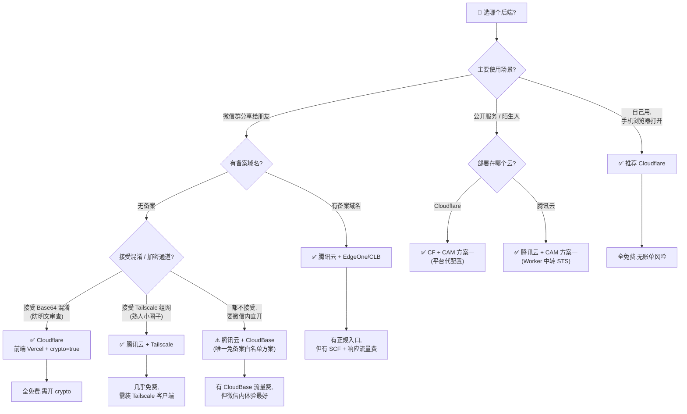

# 两平台真实计费测算与选型建议

> minist 支持两个后端:Cloudflare Worker(免费版长期有效)与腾讯云 SCF(新用户前 3 个月免费,之后按量)。本文基于**已核实的官方费率**,给出个人低频使用场景下的月成本测算、选型决策树,以及两平台的"账单炸弹"防范清单。
>
> 所有数字来自 Cloudflare Workers Free Plan 与腾讯云 SCF 计费文档(2026 年 6 月核实)。如遇官方调价,以官方为准。

---

## 目录

- [一、两平台月成本测算表](#一两平台月成本测算表)
- [二、选型决策树](#二选型决策树)
- [三、账单炸弹防范清单](#三账单炸弹防范清单)
- [四、何时该从免费迁移到付费](#四何时该从免费迁移到付费)
- [五、混合部署(进阶)](#五混合部署进阶)

---

## 一、两平台月成本测算表

### 测算前提(三种典型场景)

| 场景 | 描述 | 每天对话数 | 平均输出时长 | 平均输出字数 |
|------|------|----------|------------|------------|
| **低频** | 个人自用,偶尔角色扮演 | 30 句 | 20 s | 500 字 ≈ 1.5 KB |
| **中频** | 每天 1-2 小时角色扮演 | 100 句 | 30 s | 2000 字 ≈ 6 KB |
| **高频** | 重度用户 / 熟人共享 | 500 句 | 40 s | 3000 字 ≈ 9 KB |

> 假设:UTF-8 中文 3 字节/字;内存 128MB;每月 30 天。

### Cloudflare Worker(免费版)

CF 计费维度:请求量(100k/天)、CPU 时间(10ms/请求)、各存储读写次数。**无响应流量费**(Worker 响应不计流量)。

| 场景 | 请求量/天 | 存储读写 | 月成本 |
|------|----------|---------|--------|
| **低频** | 30 次流式 + 少量同步 ≈ 50 | KV 写 << 1000,D1 写 << 10万 | **¥0** |
| **中频** | 100 次流式 + 同步 ≈ 150 | 同上,远低于上限 | **¥0** |
| **高频** | 500 次流式 + 同步 ≈ 600 | 同上,远低于上限 | **¥0** |

**结论**:CF 免费版对个人使用几乎不可能触顶(100k 请求/天 = 每天 10 万次对话)。**唯一风险是 KV 写 1000/天**(把聊天放 KV 会爆,但 minist 设计上聊天走 D1,KV 只放读多写少索引,无风险)。

### 腾讯云 SCF(新用户前 3 个月免费,之后按量)

| 场景 | 资源量(GB·s/月) | 调用次数/月 | 响应流量/月 | 前 3 个月 | 第 4 个月起 |
|------|----------------|------------|------------|----------|------------|
| **低频** | 30×20×0.125×30 = **2250** | 900 | 1.35 MB | **¥0** | **≈ ¥0.08**(资源量)+ ¥0.001(流量)≈ **¥0.08** |
| **中频** | 100×30×0.125×30 = **11250** | 3000 | 18 MB | **¥0** | **≈ ¥0.38**(资源量)+ ¥0.014(流量)≈ **¥0.4** |
| **高频** | 500×40×0.125×30 = **75000** | 15000 | 135 MB | **¥0** | **≈ ¥2.51**(资源量)+ ¥0.108(流量)≈ **¥2.6** |

**计费公式**:

```
资源量费用 = GB·s × ¥0.0000335
  (GB·s = 内存GB × 执行秒 × 调用次数)

调用次数费用 = 次数 × ¥0.0013 / 10000   (几乎可忽略)

响应流量费用 = 字节 × ¥0.8 / GB          (不享免费额度与资源包)
```

**结论**:

- **低频**:即使 3 个月免费到期,月成本 < ¥0.1,基本免费。
- **中频**:月成本 ¥0.4,可接受。
- **高频**:月成本 ¥2.6,但仍比自建服务器便宜。**真正的账单炸弹来自异常情况**(并发风暴、超时空转、循环失败重试),见第三节。

### COS 存储费用(两平台共用,腾讯侧)

| 用途 | 容量 | 月成本 |
|------|------|--------|
| 同步备份 JSON | < 50 MB | **< ¥0.01** |
| 人物卡 PNG 直传 | < 1 GB(几百张卡) | **≈ ¥0.1** |

可忽略。

### 横向对比表

| 维度 | Cloudflare Worker 免费版 | 腾讯云 SCF(3 个月后) |
|------|------------------------|---------------------|
| **低频月成本** | **¥0** | ≈ ¥0.08 |
| **中频月成本** | **¥0** | ≈ ¥0.4 |
| **高频月成本** | **¥0** | ≈ ¥2.6 |
| **免费额度期限** | **长期免费** | 仅新用户前 3 个月 |
| **响应流量费** | ❌ 无 | ✅ 有(¥0.8/GB,不抵扣) |
| **微信内访问** | ❌ 默认域名被拦(需 Vercel 前端 + 混淆) | ❌ 默认域名被拦(需 CloudBase/Tailscale 通道) |
| **国内可达性** | 中等(部分运营商 DNS 污染) | 高(腾讯云国内节点) |
| **数据主权** | 数据经 CF 边缘节点(海外) | 数据在腾讯云(国内) |

---

## 二、选型决策树



### 决策原则速查

| 你的情况 | 选哪个 | 理由 |
|---------|--------|------|
| **自用 + 手机浏览器** | Cloudflare | 全免费,无账单风险 |
| **微信群分享 + 有备案域名** | 腾讯云 + EdgeOne | 备案域名微信信任度高,体验最正规 |
| **无备案 + 要在微信内用** | Cloudflare(Vercel 前端)+ `crypto=true`,**或** 腾讯云走 CloudBase 通道 | CF 全免费但需混淆;CloudBase 体验更好但有少量流量费 |
| **熟人小圈子 + 不想暴露公网** | 腾讯云 + Tailscale | 零成本零暴露,需装客户端 |
| **公开服务 / 陌生用户** | 任一平台 + CAM 方案一 | 平台代配置,用户主账号密钥不暴露 |
| **数据必须留在国内(合规)** | 腾讯云 | CF 边缘节点在海外,数据出境 |

### 平台特性补充

**选 Cloudflare 的额外理由**:

- 免费额度**长期有效**,不是 3 个月试用
- **无响应流量费**(腾讯 SCF 的最大隐藏成本)
- 边缘节点全球分布,海外用户访问快
- 升级 Paid 仅 $5/月,CPU 上限提到 30s

**选腾讯云的额外理由**:

- 国内节点,**国内访问延迟低且稳定**
- 数据主权在国内(合规需求)
- 微信生态集成更深(CloudBase 白名单)
- 支持人民币付款,无外汇问题

---

## 三、账单炸弹防范清单

> 两平台都有可能因配置失误 / 异常流量产生意外账单。以下是已核实并写入 `packages/deploy-agent/src/knowledge.ts` 的防范清单,部署后逐一确认。

### Cloudflare 防范

| 风险 | 触发条件 | 防范措施 | 严重度 |
|------|---------|---------|--------|
| **KV 写爆配额** | 把聊天记录放 KV(写 1000/天) | minist 已设计聊天走 D1,KV 只放读多写少数据。**勿改路由映射** | 🔴 Critical |
| **CPU 超 10ms** | Worker 逻辑臃肿(大 JSON.parse / 加密 / 大循环) | 保持 Worker 薄;升级 Paid($5/月)→ CPU 30s | 🟢 Low |
| **默认域名被墙** | 前端跑在 `*.workers.dev` / `*.pages.dev` | 前端部署到 Vercel/GitHub Pages;Worker 用自定义域名 | 🟠 High |
| **CORS 阻塞** | 后端响应缺 `Access-Control-Allow-Origin` | `@minist/shared` 已全局配 CORS;自定义头已在 Allow-Headers 声明 | 🟡 Medium |
| **CF API Token 泄露** | Token 进仓库 / 日志 | 用 `wrangler secret put`;`.dev.vars` 进 `.gitignore`;定期轮换 | 🟠 High |

**CF 免费版没有"账单炸弹"风险**:超出免费额度后是**限流**(返回 429 或静默丢弃),**不会自动转为按量计费**。这是 CF 相对腾讯 SCF 最大的成本安全性优势。

### 腾讯云 SCF 防范

| 风险 | 触发条件 | 防范措施 | 严重度 |
|------|---------|---------|--------|
| **响应流量炸弹** | 高频长对话,响应字节累积 | 限制 `max_tokens`;监控"响应流量"曲线;高频转 CF | 🔴 Critical |
| **超时空转扣费** | 超时设过高,卡在等待 LLM 时持续计费 | **超时 60s**(不是 900s);本包已 `res.end()` 主动释放 | 🟠 High |
| **并发风暴** | 并发实例无上限,突发流量启动多实例 | **最大并发实例 1**;`instanceConcurrency: 1` | 🟠 High |
| **失败重试放大** | 异步重试开启,一次失败变三次计费 | **关闭失败重试**(`asyncRunEnable: false`) | 🟠 High |
| **3 个月免费到期** | 新用户免费额度耗尽,自动转按量 | 部署时告知;设日预算 ¥1 告警;到期前评估迁移 | 🟡 Medium |
| **默认域名被微信拦** | 用 `*.service.tencentcloudapi.com` 三级域名 | 走 CloudBase 通道 ① 或 Tailscale 通道 ② | 🟠 High |
| **`scf_bootstrap` 无执行位** | 控制台上传 zip 不自动加可执行位 | 本地 `chmod +x scf_bootstrap` 后再打 zip | 🟡 Medium |
| **Node 大版本镜像升级** | 腾讯云升级 Node,`scf_bootstrap` 硬编码路径失效 | 同步改 `scf_bootstrap` 的 node 路径 | 🟡 Medium |
| **API 网关缓冲** | 部分版本缓冲 SSE,流式变一次性 | 已设 `X-Accel-Buffering: no`;异常时走 CloudBase | 🟡 Medium |
| **长期 SecretKey 驻留** | 主账号密钥写死在 SCF 代码 / 环境变量 | 用运行时临时凭证;方案一走 CAM + STS | 🟠 High |

### 必做的告警配置(两平台)

**Cloudflare**:

- Workers Analytics → 关注 KV writes/day,接近 1000 立即降频。
- Workers Analytics → 关注 CPU time p99,接近 10ms 优化逻辑或升级 Paid。

**腾讯云**:

- 费用中心 → **余额预警**(设 ¥5,低于阈值短信通知)。
- 费用中心 → **预算管理**(日预算 ¥1,触发告警,可选自动停服)。
- SCF 控制台 → 函数监控 → **响应流量曲线**(异常飙升立即排查)。
- SCF 控制台 → 函数监控 → **错误次数 / 调用次数**(失败率突增排查)。

---

## 四、何时该从免费迁移到付费

### Cloudflare:免费 → Paid($5/月)

触发条件(任一):

- 请求量持续接近 100k/天(罕见,个人用很难)。
- CPU 时间经常超 10ms(Worker 逻辑变重)。
- 需要自定义域名 / D1 高级特性 / R2 大流量。

迁移成本:$5/月,无脑升级,数据不迁移。

### 腾讯云 SCF:免费期 → 按量

**不可避免**:新用户免费额度仅前 3 个月,到期自动转按量。

应对策略:

1. **低频用户**:继续 SCF 按量,月成本 < ¥0.1,可忽略。
2. **中频用户**:评估是否迁 CF。CF 全免费 + 无响应流量费,长期更省。
3. **高频用户**:强烈建议迁 CF。腾讯 SCF 高频月成本 ¥2.6,且响应流量费随使用线性增长。

迁移路径:

```bash
# 1. 在 CF 部署 Worker(见 deploy-cloudflare.md)
# 2. 在酒馆设置面板切换 backend = cloudflare,apiBaseUrl = Worker URL
# 3. 数据迁移:在腾讯 SCF 路由 GET /api/sync/:userId 拉取整包,POST 到 CF /api/sync
```

---

## 五、混合部署(进阶)

minist 的设计允许两种后端同时存在,按需切换:

### 场景:国内用户走腾讯云,海外用户走 Cloudflare

- 部署两个后端:CF Worker(海外)+ 腾讯 SCF(国内)。
- 前端 `apiBaseUrl` 根据用户地理位置或手动选择切换。
- 数据通过 `/api/sync` 双向同步(注意冲突合并,minist 当前是整包覆盖,适合低频)。

### 场景:CF 做主存储,腾讯 SCF 做微信入口

- 主后端 CF(全免费,数据沉淀)。
- 腾讯 SCF 仅作微信内置浏览器的入口代理(走 CloudBase 通道),`LLM_PROXY_URL` 指向 CF Worker 而非 LLM 直连。
- 这样微信用户也能用,且主数据走 CF 无响应流量费。

> ⚠️ 混合部署增加复杂度,仅推荐进阶用户。新人建议先单平台跑通,再考虑混合。

---

## 附:费用速算工具

把下面的公式存成 `cost-calc.sh`,输入对话数估算:

```bash
#!/bin/bash
# 用法: ./cost-calc.sh <每天对话数> <平均输出时长秒> <平均输出字数>
DAILY=${1:-30}
DURATION=${2:-20}
WORDS=${3:-500}

# 腾讯云 SCF(3 个月后)
GBS=$(echo "scale=2; $DAILY * $DURATION * 0.125 * 30" | bc)
RESP_BYTES=$(echo "scale=2; $DAILY * $WORDS * 3 * 30" | bc)  # 3 bytes/中文字
RESP_GB=$(echo "scale=6; $RESP_BYTES / 1073741824" | bc)
SCF_COST=$(echo "scale=4; $GBS * 0.0000335 + $RESP_GB * 0.8" | bc)

echo "每天 $DAILY 句 × $DURATION 秒 × $WORDS 字"
echo "腾讯云 SCF 月成本 ≈ ¥$SCF_COST  (资源量 $GBS GB·s + 响应流量 $RESP_GB GB)"
echo "Cloudflare 月成本 ≈ ¥0  (免费版,无响应流量费)"
```

示例输出:

```
$ ./cost-calc.sh 100 30 2000
每天 100 句 × 30 秒 × 2000 字
腾讯云 SCF 月成本 ≈ ¥.3935  (资源量 11250 GB·s + 响应流量 .0167 GB)
Cloudflare 月成本 ≈ ¥0  (免费版,无响应流量费)
```

---

## 结论

| 你的画像 | 推荐方案 | 预期月成本 |
|---------|---------|----------|
| **个人自用,手机浏览器** | Cloudflare | ¥0 |
| **微信群分享,有备案** | 腾讯云 + EdgeOne | ¥0.1~3 |
| **微信内用,无备案** | CF + Vercel + crypto,或腾讯云 + CloudBase | ¥0~3 |
| **熟人小圈子,零暴露** | 腾讯云 + Tailscale | ¥0.1~3 |
| **公开服务** | 任一 + CAM 方案一 | 按量 |

**一句话总结**:追求零成本与零账单风险选 Cloudflare;追求国内稳定与微信生态集成选腾讯云。两者 minist 都支持,可随时切换。

---

参考:[架构说明](./architecture.md) · [Cloudflare 部署](./deploy-cloudflare.md) · [腾讯云部署](./deploy-tencent.md)

License: AGPL-3.0-only · minist contributors
